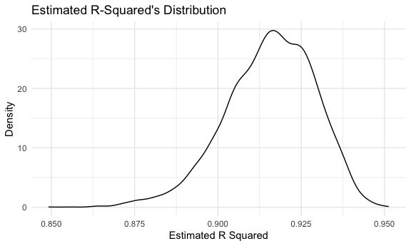

p8105_hw6_zz3168
================
Zixuan Zhang
2023-11-28

``` r
library(tidyverse)
```

    ## ── Attaching core tidyverse packages ──────────────────────── tidyverse 2.0.0 ──
    ## ✔ dplyr     1.1.3     ✔ readr     2.1.4
    ## ✔ forcats   1.0.0     ✔ stringr   1.5.0
    ## ✔ ggplot2   3.4.3     ✔ tibble    3.2.1
    ## ✔ lubridate 1.9.2     ✔ tidyr     1.3.0
    ## ✔ purrr     1.0.2     
    ## ── Conflicts ────────────────────────────────────────── tidyverse_conflicts() ──
    ## ✖ dplyr::filter() masks stats::filter()
    ## ✖ dplyr::lag()    masks stats::lag()
    ## ℹ Use the conflicted package (<http://conflicted.r-lib.org/>) to force all conflicts to become errors

``` r
library(modelr)
library(mgcv)
```

    ## Loading required package: nlme
    ## 
    ## Attaching package: 'nlme'
    ## 
    ## The following object is masked from 'package:dplyr':
    ## 
    ##     collapse
    ## 
    ## This is mgcv 1.9-0. For overview type 'help("mgcv-package")'.

``` r
set.seed(1)

knitr::opts_chunk$set(
  fig.width = 6,
  fig.asp = .6,
  out.width = "90%"
)

theme_set(theme_minimal())

options(
  ggplot2.continuous.colour = "viridis",
  ggplot2.continuous.fill = "viridis"
)

scale_colour_discrete = scale_colour_viridis_d
scale_fill_discrete = scale_fill_viridis_d
```

### Problem 1

In the data cleaning code below we create a `city_state` variable,
change `victim_age` to numeric, modifiy victim_race to have categories
white and non-white, with white as the reference category, and create a
`resolution` variable indicating whether the homicide is solved.

``` r
homicide_df = 
  read_csv("data/homicide-data.csv", na = c("", "NA", "Unknown")) |> 
  mutate(
    city_state = str_c(city, state, sep = ", "),
    victim_age = as.numeric(victim_age),
    resolution = case_when(
      disposition == "Closed without arrest" ~ 0,
      disposition == "Open/No arrest"        ~ 0,
      disposition == "Closed by arrest"      ~ 1)
  ) |> 
  filter(victim_race %in% c("White", "Black")) |> 
  filter(!(city_state %in% c("Tulsa, AL", "Dallas, TX", "Phoenix, AZ", "Kansas City, MO"))) |> 
  select(city_state, resolution, victim_age, victim_sex, victim_race)
```

    ## Rows: 52179 Columns: 12
    ## ── Column specification ────────────────────────────────────────────────────────
    ## Delimiter: ","
    ## chr (8): uid, victim_last, victim_first, victim_race, victim_sex, city, stat...
    ## dbl (4): reported_date, victim_age, lat, lon
    ## 
    ## ℹ Use `spec()` to retrieve the full column specification for this data.
    ## ℹ Specify the column types or set `show_col_types = FALSE` to quiet this message.

Next we fit a logistic regression model using only data from Baltimore,
MD. We model `resolved` as the outcome and `victim_age`, `victim_sex`,
and `victim_race` as predictors. We save the output as `baltimore_glm`
so that we can apply `broom::tidy` to this object and obtain the
estimate and confidence interval of the adjusted odds ratio for solving
homicides comparing non-white victims to white victims.

``` r
baltimore_glm = 
  filter(homicide_df, city_state == "Baltimore, MD") |> 
  glm(resolution ~ victim_age + victim_sex + victim_race, family = binomial(), data = _)

baltimore_glm |> 
  broom::tidy() |> 
  mutate(
    OR = exp(estimate), 
    OR_CI_upper = exp(estimate + 1.96 * std.error),
    OR_CI_lower = exp(estimate - 1.96 * std.error)) |> 
  filter(term == "victim_sexMale") |> 
  select(OR, OR_CI_lower, OR_CI_upper) |>
  knitr::kable(digits = 3)
```

|    OR | OR_CI_lower | OR_CI_upper |
|------:|------------:|------------:|
| 0.426 |       0.325 |       0.558 |

Below, by incorporating `nest()`, `map()`, and `unnest()` into the
preceding Baltimore-specific code, we fit a model for each of the
cities, and extract the adjusted odds ratio (and CI) for solving
homicides comparing non-white victims to white victims. We show the
first 5 rows of the resulting dataframe of model results.

``` r
model_results = 
  homicide_df |> 
  nest(data = -city_state) |> 
  mutate(
    models = map(data, \(df) glm(resolution ~ victim_age + victim_sex + victim_race, 
                             family = binomial(), data = df)),
    tidy_models = map(models, broom::tidy)) |> 
  select(-models, -data) |> 
  unnest(cols = tidy_models) |> 
  mutate(
    OR = exp(estimate), 
    OR_CI_upper = exp(estimate + 1.96 * std.error),
    OR_CI_lower = exp(estimate - 1.96 * std.error)) |> 
  filter(term == "victim_sexMale") |> 
  select(city_state, OR, OR_CI_lower, OR_CI_upper)

model_results |>
  slice(1:5) |> 
  knitr::kable(digits = 3)
```

| city_state      |    OR | OR_CI_lower | OR_CI_upper |
|:----------------|------:|------------:|------------:|
| Albuquerque, NM | 1.767 |       0.831 |       3.761 |
| Atlanta, GA     | 1.000 |       0.684 |       1.463 |
| Baltimore, MD   | 0.426 |       0.325 |       0.558 |
| Baton Rouge, LA | 0.381 |       0.209 |       0.695 |
| Birmingham, AL  | 0.870 |       0.574 |       1.318 |

Below we generate a plot of the estimated ORs and CIs for each city,
ordered by magnitude of the OR from smallest to largest. From this plot
we see that most cities have odds ratios that are smaller than 1,
suggesting that crimes with male victims have smaller odds of resolution
compared to crimes with female victims after adjusting for victim age
and race. This disparity is strongest in New yrok. In roughly half of
these cities, confidence intervals are narrow and do not contain 1,
suggesting a significant difference in resolution rates by sex after
adjustment for victim age and race.

``` r
model_results |> 
  mutate(city_state = fct_reorder(city_state, OR)) |> 
  ggplot(aes(x = city_state, y = OR)) + 
  geom_point() + 
  geom_errorbar(aes(ymin = OR_CI_lower, ymax = OR_CI_upper)) + 
  theme(axis.text.x = element_text(angle = 90, hjust = 1))
```


### Problem 2

``` r
weather_df = 
  rnoaa::meteo_pull_monitors(
    c("USW00094728"),
    var = c("PRCP", "TMIN", "TMAX"), 
    date_min = "2022-01-01",
    date_max = "2022-12-31") |>
  mutate(
    name = recode(id, USW00094728 = "CentralPark_NY"),
    tmin = tmin / 10,
    tmax = tmax / 10) |>
  select(name, id, everything())
```

    ## using cached file: /Users/draboost/Library/Caches/org.R-project.R/R/rnoaa/noaa_ghcnd/USW00094728.dly

    ## date created (size, mb): 2023-09-28 10:20:07.882969 (8.524)

    ## file min/max dates: 1869-01-01 / 2023-09-30

do the r regression

``` r
boost_sample_r = 
  weather_df |> 
  bootstrap(n = 5000) |> 
  mutate(
    models = map(strap, ~lm(tmax ~ tmin, data = .x)),
    results = map(models, broom::glance)
  ) |> 
  select(-strap, -models) |> 
  unnest(results) |> 
  janitor::clean_names()

conf_r =
  boost_sample_r |> 
  summarize(
    c_lower = quantile(r_squared, 0.025),
    c_upper = quantile(r_squared, 0.975)
  ) |> 
    knitr::kable()
```

\#Identify the 2.5% and 97.5% quantiles

``` r
boost_sample_b = 
  weather_df |> 
  bootstrap(n = 5000) |> 
  mutate(
    models = map(strap, ~lm(tmax ~ tmin + prcp, data = .x)),
    results = map(models, broom::tidy)
  ) |> 
  select(-strap, -models) |> 
  unnest(results) |>
  select(id = `.id`, term, estimate) |> 
  pivot_wider(
    names_from = term,
    values_from = estimate
  ) |> 
  janitor::clean_names() |> 
  rename(beta0 = intercept, beta1 = tmin, beta2 = prcp) |> 
  mutate(
    log_b1 = log(beta0 * beta1),
    log_b2 = log(beta1 * beta2)
  )
```

    ## Warning: There was 1 warning in `mutate()`.
    ## ℹ In argument: `log_b2 = log(beta1 * beta2)`.
    ## Caused by warning in `log()`:
    ## ! NaNs produced

``` r
conf_beta0 = 
  boost_sample_b |> 
  summarize(
    c_lower = quantile(log_b1, 0.025),
    c_upper = quantile(log_b1, 0.975)
  ) |> 
 knitr::kable() 


conf_beta1 = 
  boost_sample_b |> 
  summarize(
    c_lower = quantile(log_b2, 0.025,na.rm = TRUE),
    c_upper = quantile(log_b2, 0.975,na.rm = TRUE)
  ) |> 
 knitr::kable() 
```

According to the result, The 2.5% and 97.5% quantiles of of log(beta
1\*beta 2) is -8.88 and -4.60. The 2.5% and 97.5% quantiles of R squard
is 0.89 and 0.94.

# do the r plot

``` r
boost_sample_r |> 
  ggplot(aes(x = r_squared)) +
  geom_density()+
  labs(
    title = "Estimated R-Squared's Distribution ",
    x = "Estimated R Squared",
    y = "Density"
  )
```



\#do the plot for Beta

``` r
boost_sample_b |> 
  select(log_b2) |> 
  ggplot(aes(x = log_b2)) + 
  geom_density() + 
  labs(
    title = "Estimated Beta Distribution",
    x = "Estimated Beta1 * Beta2",
    y = "Density"
  )
```

    ## Warning: Removed 3304 rows containing non-finite values (`stat_density()`).


According to the plot , we could see that the plot for R suqard is
approximately normal, and the plot for log(beta 1\*beta 2) is skewed to
the left.

### Problem 3

\##clean and tidy the data

``` r
birthwt_df = 
  read_csv("./data/birthweight.csv") |> 
  mutate(
    babysex = as.factor(babysex),
    frace = as.factor(frace),
    mrace = as.factor(mrace),
    malform = as.factor(malform)
  ) |> 
  janitor::clean_names()
```

    ## Rows: 4342 Columns: 20
    ## ── Column specification ────────────────────────────────────────────────────────
    ## Delimiter: ","
    ## dbl (20): babysex, bhead, blength, bwt, delwt, fincome, frace, gaweeks, malf...
    ## 
    ## ℹ Use `spec()` to retrieve the full column specification for this data.
    ## ℹ Specify the column types or set `show_col_types = FALSE` to quiet this message.

\##build a regression model for birthweight.

``` r
model_fit =
  lm(bwt ~ babysex + bhead + blength + mrace + smoken, data = birthwt_df) 
```

My model is based on factors that underlie birth weight. and consider
the baby’s head circumference at birth, baby’s length at birth, and
mother’s race will influence the babay’s birth weight, so i use these
data for delivery in years and average number of cigarettes smoked per
day during pregnancy for predictors.

\##plot of Model Residuals

``` r
plot_df = 
birthwt_df |> 
  select(bwt, babysex, bhead, blength, mrace, smoken) |> 
  add_residuals(model_fit) |> 
  add_predictions(model_fit) |> 
  ggplot(aes(x = pred, y = resid)) +
  geom_violin() 
```

## the other model

``` r
model_2 = 
  lm(bwt ~ blength + gaweeks, data = birthwt_df) |> 
  broom::tidy()

model_3 = 
  lm(bwt ~ bhead* babysex + blength* babysex + bhead* blength* babysex, data = birthwt_df) |> 
   broom::tidy()
```

\##compare the model

``` r
cv_df = 
  crossv_mc(birthwt_df, 100) |>
  mutate(
    train = map(train, as_tibble),
    test = map(test, as_tibble)) |> 
  mutate(
    model_1 = map(train, \(df) lm(bwt ~ babysex + bhead + blength + mrace + smoken, data = df)),
    model_2 = map(train, \(df) lm(bwt ~ blength + gaweeks, data = df)),
    model_3 = map(train, \(df) lm(bwt ~ bhead* babysex + blength* babysex + bhead* blength* babysex, data = df))
  ) |> 
   mutate(
    rmse_1 = map2_dbl(model_1, test, \(mod, df) rmse(model = mod, data = df)),
    rmse_2 = map2_dbl(model_2, test, \(mod, df) rmse(model = mod, data = df)),
    rmse_3 = map2_dbl(model_3, test, \(mod, df) rmse(model = mod, data = df)))
```

``` r
cv_df |> 
  select(starts_with("rmse")) |> 
  pivot_longer(
    everything(),
    names_to = "model", 
    values_to = "rmse",
    names_prefix = "rmse_") |> 
  mutate(model = fct_inorder(model)) |> 
  ggplot(aes(x = model, y = rmse)) + 
  geom_violin()
```


According to the plot we could saw that the model 2 has the highest
values of rmse, and the my model have the lowest rmse.
