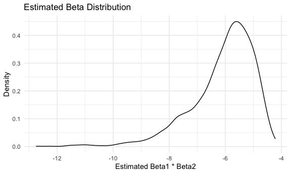

p8105_hw6_zz3168
================
Zixuan Zhang
2023-11-28

``` r
library(tidyverse)
```

    ## ── Attaching core tidyverse packages ──────────────────────── tidyverse 2.0.0 ──
    ## ✔ dplyr     1.1.3     ✔ readr     2.1.4
    ## ✔ forcats   1.0.0     ✔ stringr   1.5.0
    ## ✔ ggplot2   3.4.3     ✔ tibble    3.2.1
    ## ✔ lubridate 1.9.2     ✔ tidyr     1.3.0
    ## ✔ purrr     1.0.2     
    ## ── Conflicts ────────────────────────────────────────── tidyverse_conflicts() ──
    ## ✖ dplyr::filter() masks stats::filter()
    ## ✖ dplyr::lag()    masks stats::lag()
    ## ℹ Use the conflicted package (<http://conflicted.r-lib.org/>) to force all conflicts to become errors

``` r
library(modelr)
library(mgcv)
```

    ## Loading required package: nlme
    ## 
    ## Attaching package: 'nlme'
    ## 
    ## The following object is masked from 'package:dplyr':
    ## 
    ##     collapse
    ## 
    ## This is mgcv 1.9-0. For overview type 'help("mgcv-package")'.

``` r
set.seed(1)

knitr::opts_chunk$set(
  fig.width = 6,
  fig.asp = .6,
  out.width = "90%"
)

theme_set(theme_minimal())

options(
  ggplot2.continuous.colour = "viridis",
  ggplot2.continuous.fill = "viridis"
)

scale_colour_discrete = scale_colour_viridis_d
scale_fill_discrete = scale_fill_viridis_d
```

### Problem 2

``` r
weather_df = 
  rnoaa::meteo_pull_monitors(
    c("USW00094728"),
    var = c("PRCP", "TMIN", "TMAX"), 
    date_min = "2022-01-01",
    date_max = "2022-12-31") |>
  mutate(
    name = recode(id, USW00094728 = "CentralPark_NY"),
    tmin = tmin / 10,
    tmax = tmax / 10) |>
  select(name, id, everything())
```

    ## using cached file: /Users/draboost/Library/Caches/org.R-project.R/R/rnoaa/noaa_ghcnd/USW00094728.dly

    ## date created (size, mb): 2023-09-28 10:20:07.882969 (8.524)

    ## file min/max dates: 1869-01-01 / 2023-09-30

do the r regression

``` r
boost_sample_r = 
  weather_df |> 
  bootstrap(n = 5000) |> 
  mutate(
    models = map(strap, ~lm(tmax ~ tmin, data = .x)),
    results = map(models, broom::glance)
  ) |> 
  select(-strap, -models) |> 
  unnest(results) |> 
  janitor::clean_names()

conf_r =
  boost_sample_r |> 
  summarize(
    c_lower = quantile(r_squared, 0.025),
    c_upper = quantile(r_squared, 0.975)
  ) |> 
    knitr::kable()
```

\#Identify the 2.5% and 97.5% quantiles

``` r
boost_sample_b = 
  weather_df |> 
  bootstrap(n = 5000) |> 
  mutate(
    models = map(strap, ~lm(tmax ~ tmin + prcp, data = .x)),
    results = map(models, broom::tidy)
  ) |> 
  select(-strap, -models) |> 
  unnest(results) |>
  select(id = `.id`, term, estimate) |> 
  pivot_wider(
    names_from = term,
    values_from = estimate
  ) |> 
  janitor::clean_names() |> 
  rename(beta0 = intercept, beta1 = tmin, beta2 = prcp) |> 
  mutate(
    log_b1 = log(beta0 * beta1),
    log_b2 = log(beta1 * beta2)
  )
```

    ## Warning: There was 1 warning in `mutate()`.
    ## ℹ In argument: `log_b2 = log(beta1 * beta2)`.
    ## Caused by warning in `log()`:
    ## ! NaNs produced

``` r
conf_beta0 = 
  boost_sample_b |> 
  summarize(
    c_lower = quantile(log_b1, 0.025),
    c_upper = quantile(log_b1, 0.975)
  ) |> 
 knitr::kable() 


conf_beta1 = 
  boost_sample_b |> 
  summarize(
    c_lower = quantile(log_b2, 0.025,na.rm = TRUE),
    c_upper = quantile(log_b2, 0.975,na.rm = TRUE)
  ) |> 
 knitr::kable() 
```

According to the result, The 2.5% and 97.5% quantiles of of log(beta
1\*beta 2) is -8.86 and -4.60. The 2.5% and 97.5% quantiles of R squard
is 0.89 and 0.94.

# do the r plot

``` r
boost_sample_r |> 
  ggplot(aes(x = r_squared)) +
  geom_density()+
  labs(
    title = "Estimated R-Squared's Distribution ",
    x = "Estimated R Squared",
    y = "Density"
  )
```


\#do the plot for Beta

``` r
boost_sample_b |> 
  select(log_b2) |> 
  ggplot(aes(x = log_b2)) + 
  geom_density() + 
  labs(
    title = "Estimated Beta Distribution",
    x = "Estimated Beta1 * Beta2",
    y = "Density"
  )
```

    ## Warning: Removed 3304 rows containing non-finite values (`stat_density()`).


According to the plot , we could see that the plot for R suqard is
approximately normal, and the plot for log(beta 1\*beta 2) is skewed to
the left.

### Problem 3

\##clean and tidy the data

``` r
birthwt_df = 
  read_csv("./data/birthweight.csv") |> 
  mutate(
    babysex = as.factor(babysex),
    frace = as.factor(frace),
    mrace = as.factor(mrace),
    malform = as.factor(malform)
  ) |> 
  janitor::clean_names()
```

    ## Rows: 4342 Columns: 20
    ## ── Column specification ────────────────────────────────────────────────────────
    ## Delimiter: ","
    ## dbl (20): babysex, bhead, blength, bwt, delwt, fincome, frace, gaweeks, malf...
    ## 
    ## ℹ Use `spec()` to retrieve the full column specification for this data.
    ## ℹ Specify the column types or set `show_col_types = FALSE` to quiet this message.

\##build a regression model for birthweight.

``` r
model_fit =
  lm(bwt ~ babysex + bhead + blength + mrace + smoken, data = birthwt_df) 
```

\##plot of Model Residuals

``` r
plot_df = 
birthwt_df |> 
  select(bwt, babysex, bhead, blength, mrace, smoken) |> 
  add_residuals(model_fit) |> 
  add_predictions(model_fit) |> 
  ggplot(aes(x = pred, y = resid)) +
  geom_violin() 
```

## the other model

``` r
model_2 = 
  lm(bwt ~ blength + gaweeks, data = birthwt_df) |> 
  broom::tidy()

model_3 = 
  lm(bwt ~ bhead + blength + babysex + bhead* blength* babysex, data = birthwt_df) |> 
   broom::tidy()
```

\##compare the model

``` r
cv_df = 
  crossv_mc(birthwt_df, 100) |>
  mutate(
    train = map(train, as_tibble),
    test = map(test, as_tibble)) |> 
  mutate(
    model_1 = map(train, \(df) lm(bwt ~ babysex + bhead + blength + mrace + smoken, data = birthwt_df)),
    model_2 = map(train, \(df) lm(bwt ~ blength + gaweeks, data = df)),
    model_3 = map(train, \(df) lm(bwt ~ bhead + blength + babysex + bhead*blength*babysex, data = df))
  ) |> 
   mutate(
    rmse_1 = map2_dbl(model_1, test, \(mod, df) rmse(model = mod, data = df)),
    rmse_2 = map2_dbl(model_2, test, \(mod, df) rmse(model = mod, data = df)),
    rmse_3 = map2_dbl(model_3, test, \(mod, df) rmse(model = mod, data = df)))
```

``` r
cv_df |> 
  select(starts_with("rmse")) |> 
  pivot_longer(
    everything(),
    names_to = "model", 
    values_to = "rmse",
    names_prefix = "rmse_") |> 
  mutate(model = fct_inorder(model)) |> 
  ggplot(aes(x = model, y = rmse)) + 
  geom_violin()
```


